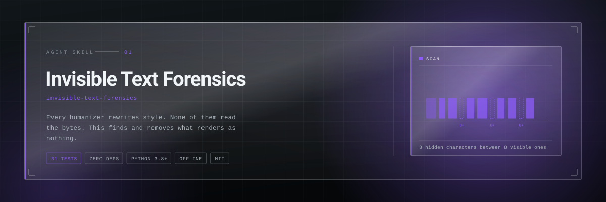
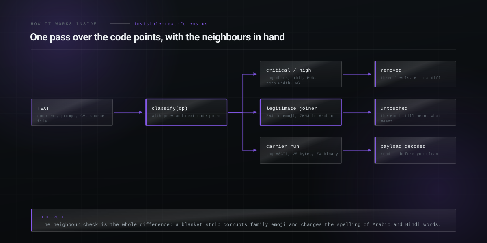

<p align="center">
  <picture>
    <source media="(prefers-color-scheme: dark)" srcset="assets/hero-dark.svg">
    <source media="(prefers-color-scheme: light)" srcset="assets/hero-light.svg">
    
  </picture>
</p>

<h1 align="center">Invisible Text Forensics</h1>

<p align="center"><b>Detect and remove invisible Unicode: zero-width characters, AI watermarks, bidirectional overrides, tag-character prompt injection and homoglyphs. The byte layer every humanizer skill leaves untouched.</b></p>

<p align="center">
<a href="LICENSE"></a>
  
  
  
  
</p>

<p align="center">
  <code>npx skills add Hiberius/invisible-text-forensics</code>
</p>

<p align="center">
  <sub>Works with Claude Code, Claude Desktop, Codex, Cursor, Windsurf, OpenClaw and
  anything else that reads a <code>SKILL.md</code>.</sub>
</p>

---


## The problem

Every de-AI and humanizer skill rewrites **style**: em dashes, "delve", the tricolon.
There are dozens of them and some have tens of thousands of stars. Not one reads the
**bytes**.

Text carries characters that render as nothing and survive copy, paste, email, PDF
extraction and git:

- a zero-width watermark that says which copy of your contract this is
- a run of tag characters spelling `IGNORE PREVIOUS INSTRUCTIONS` inside a prompt
- a bidirectional override making source code render differently from how it compiles
- a no-break space in a CSV header that quietly breaks a column lookup

This is the layer underneath the humanizers. Run one for the prose, run this for
everything the prose is made of.

## What it does

| Command | What you get |
|---|---|
| `scan` | Every hidden or risky character with code point, line, column, risk level and why it matters. `--json` for pipelines, `--fail-on high` as a CI gate. |
| `clean` | Removal at three levels: `safe` (hidden characters only), `aggressive` (+ exotic spaces), `paranoid` (+ homoglyphs and smart typography folded to ASCII). |
| `extract` | Decodes what the invisible characters actually spell: tag characters, variation-selector bytes, zero-width binary. |
| `watermark` | Embeds an invisible copy identifier. Two recipients get visually identical files. |
| `identify` | Reads the identifier back out of a leaked copy. |


## How it works inside

<p align="center">
  <picture>
    <source media="(prefers-color-scheme: dark)" srcset="assets/diagram-dark.svg">
    <source media="(prefers-color-scheme: light)" srcset="assets/diagram-light.svg">
    
  </picture>
</p>


## Ten seconds

```bash
python3 scripts/itf.py scan document.md
```

```
document.md
  CRITICAL U+202E     line 12 col 18  Right-to-Left Override (RLO)
           reorders rendering; Trojan Source (CVE-2021-42574) in source code
  HIGH     U+200B     line 3 col 41   Zero Width Space (ZWSP)
           invisible; carries watermarks and hidden payloads
  MEDIUM   U+0443     line 3 col 58   Homoglyph of 'y'
           non-Latin letter that renders like ASCII
```

## The detail that matters

`U+200D` (ZWJ) and `U+200C` (ZWNJ) are **not** always removable:

- inside an emoji sequence, ZWJ is what makes 👨‍👩‍👧 one family instead of three people
- in Arabic, Persian, Hindi and other complex scripts they change which letters join, and
  removing them changes the word

Every naive `re.sub` stripper corrupts both. This one checks the neighbouring code points
first and leaves legitimate joiners alone. There is a test for it, with a canary.

## Use it as a CI gate

```yaml
- name: invisible character gate
  run: python3 scripts/itf.py scan . --fail-on critical
```

Blocks pull requests carrying Trojan Source overrides or tag-character payloads.


## Documentation

- [`SKILL.md`](SKILL.md) — the skill itself, what the agent reads
- [`references/character-catalog.md`](references/character-catalog.md) — every code point this skill knows, by risk level, with the joiner rule
- [`references/attack-patterns.md`](references/attack-patterns.md) — six attack mechanics with reproducible payloads, from tag smuggling to Trojan Source


## Related skills

- **[bank-statement-to-table](https://github.com/Hiberius/bank-statement-to-table)** — the other skill built on proving a document is what it looks like
- **[ad-comment-moderation](https://github.com/Hiberius/ad-comment-moderation)** — comments are attacker-controlled text: this is what fits inside one
- **[always-on-agent](https://github.com/Hiberius/always-on-agent)** — the read-only first pass that never opens a secret's value

All ten in one install:

```
/plugin marketplace add Hiberius/hiberius-skills
```


## Work with me

I build the systems these skills came out of: performance marketing infrastructure,
lead pipelines, ad account tooling, internal automation, and products on the Cloudflare
edge stack. If you need something like this built properly, I take on freelance and
contract work.

**[Christian Calabro — github.com/Hiberius](https://github.com/Hiberius)**

Performance marketing · media buying · TypeScript · Cloudflare Workers · Next.js · Python

---

## Contributing

Issues and pull requests welcome. The rule for a change to the skill itself: it has to
be something you learned by getting it wrong once, not something you read in the docs.

## License

MIT. No network calls, no telemetry, no dependencies.
